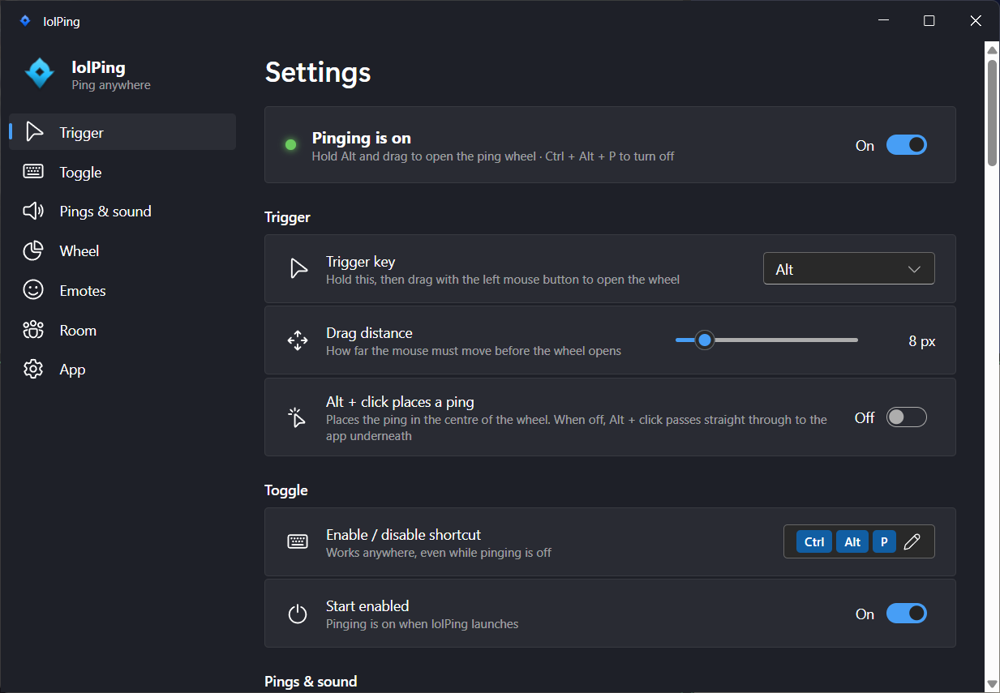

<h1 align="center"><br>lolPing</h1>

<p align="center">
  English | <a href="README.zh-CN.md">简体中文</a>
</p>

<p align="center">
  League of Legends pings and emotes for your whole desktop, on Windows and macOS.<br>
  Hold <b>Alt</b> (<b>⌥ Option</b> on a Mac), drag, and let go on a ping. The animation pops and the sound plays on top of any app, on any monitor.<br>
  Hold <b>Ctrl</b> (<b>⌃ Control</b> on a Mac) and drag for the emote wheel: League's emotes, or your own images.
</p>

<p align="center">
  <a href="https://github.com/darrenprx/lolPing/releases/latest"><b>Download for Windows</b></a> ·
  <a href="https://github.com/darrenprx/lolPing/releases/latest"><b>Download for Mac</b></a> (Apple Silicon, experimental)
</p>

<p align="center">
  <a href="https://github.com/darrenprx/lolPing/actions/workflows/ci.yml"></a>
  <a href="https://github.com/darrenprx/lolPing/releases/latest"></a>
  <a href="LICENSE"></a>
</p>

<p align="center"></p>

Pings and emotes show up in whole-screen capture, so friends watching your Discord or OBS stream see them too. lolPing is a desktop toy: it doesn't read, change or hook into League itself.

## Install

### Windows

1. Download `lolPing-Setup-<version>.exe` from the [latest release](https://github.com/darrenprx/lolPing/releases/latest).
2. Run it. The installer isn't code-signed, so Windows SmartScreen may say "Windows protected your PC". Select **More info**, then **Run anyway**.
3. lolPing opens its settings and moves to the tray. Hold Alt and drag anywhere to ping.

lolPing is built for Windows 11, 64-bit. Windows 10 may work, but it isn't tested.

### macOS (experimental)

The Mac version needs an Apple Silicon Mac (M1 or later) and macOS 12 or later. It is built and tested automatically, but hasn't had much use on real Macs yet. Please [report](https://github.com/darrenprx/lolPing/issues) anything that doesn't work.

1. Download `lolPing-<version>-arm64.dmg` from the [latest release](https://github.com/darrenprx/lolPing/releases/latest), open it, and drag lolPing into Applications.
2. Open lolPing. It isn't signed by a registered Apple developer, so macOS says it can't check it for malware. Select **Done**, open **System Settings → Privacy & Security**, scroll down, select **Open Anyway** next to the lolPing message, and confirm.
   If macOS instead says lolPing "is damaged", run `xattr -dr com.apple.quarantine /Applications/lolPing.app` in Terminal and open it again.
3. lolPing asks for **Accessibility** access, which it needs to read the mouse and keyboard. Select **Open System Settings** and turn lolPing on. Pinging starts as soon as it's allowed.
4. lolPing lives in the menu bar. Hold ⌥ Option and drag anywhere to ping.

**After every update**, macOS forgets the Accessibility permission, because the app isn't signed with a fixed developer identity. In **Privacy & Security → Accessibility**, select lolPing, remove it with **–**, then turn it on again. The settings window walks you through it.

### Updating an older version

Updating from v0.4 or earlier: download the new version by hand once. From v0.5 on, lolPing updates itself (see [Updates](#updates)).

## Use

| To | Do this |
| --- | --- |
| Ping | Hold **Alt**, drag, and let go on a slice |
| Emote | Hold **Ctrl**, drag, and let go on an emote |
| Cancel | Let go in the centre, right-click, or press **Esc** |
| Pause or resume pinging | **Ctrl + Alt + P** |
| Open settings | Click the tray icon |
| Quit, or restart the input helper | Right-click the tray icon |

On a Mac, use **⌥ Option** instead of Alt, **⌃ Control** instead of Ctrl for emotes, **⌃⌥P** to pause, and the ping icon in the menu bar instead of the tray icon.

The wheel, from the top going clockwise: Danger, Push, On My Way, All In, Assist Me, Need Vision, Enemy Missing, Enemy Vision. You can rearrange it and add Bait or Vision Cleared in settings. The emote wheel has 8 slots too, and you pick its emotes in settings.

## Settings



- **Trigger key:** Alt, Ctrl, Shift, Win, Caps Lock, Mouse 4, Mouse 5 or any other key (on a Mac: Option, Control, Shift, Command, Mouse 4, Mouse 5 or any other key). The custom key won't type in other apps while pinging is on.
- **Alt + click places a ping:** off by default, so ordinary Alt + click shortcuts keep working. The ping is the one in the centre of the wheel editor (Generic unless you change it).
- **Enable / disable shortcut:** must include Ctrl, Alt or Win (⌃, ⌥ or ⌘ on a Mac).
- **Pings and sound:** size, duration, volume, mute and the wheel's tick sound.
- **Wheel:** drag any ping onto any slice, including Bait and Vision Cleared, or onto the centre to make it the Alt + click ping. Click a ping to preview it. **Reset to default** brings back League's layout.
- **Emotes:** the emote key (Ctrl by default, or off), **Ctrl + click places an emote** (off by default), emote size, emote sound and the emote wheel, which you edit like the ping wheel. **Add image…**, or dropping a file on the list, adds your own images: PNG, JPG, GIF or WebP, up to 24. Animated ones play on your screen only.
- **Launch at Windows startup** (**Open at login** on a Mac): starts hidden in the tray or menu bar.
- **Language:** follows the system display language, or pick English or 简体中文.

Settings are saved in `%APPDATA%\lolPing\settings.json` on Windows and `~/Library/Application Support/lolPing/settings.json` on a Mac.

## Updates

lolPing checks GitHub for a new version 10 seconds after it starts, then every 6 hours. When there is one, you get a notice on screen, and the tray menu and **Settings → App → About** offer **Update**. It asks first: nothing downloads until you click.

- **Windows:** one click downloads the installer, verifies it, installs it silently into the same folder and restarts lolPing. The settings window opens after the restart.
- **Mac:** lolPing downloads the disk image to your Downloads folder, verifies it, explains what to do, opens it, and quits. Drag lolPing into Applications, choose **Replace**, open it, and allow Accessibility again.
- **Check for updates** in the tray menu, or in **Settings → App → About**, checks right away. From the tray, the result (up to date, or what went wrong) appears as a notice on screen.
- **Check for updates automatically** (Settings → App, on by default) controls the scheduled checks. With it off, lolPing contacts GitHub only when you click **Check for updates** or **Update**.
- **Privacy:** a check tells GitHub your IP address and lolPing's version, nothing else.

## Ping with friends (rooms)

Join a room and everyone in it sees your pings on their own screen, at the same spot (scaled to their resolution), with your name under them. Their pings show up on yours. It works between Windows and Mac.

1. One person opens **Settings → Room** (or the tray menu → **Room**) and clicks **Create room**.
2. They copy the code, such as `PING-7KQ4M-2HXTR`, and send it to friends.
3. Each friend copies it and clicks **Join from clipboard** in the tray menu, or pastes it into the Room page and clicks **Join**.

- **Same network:** the first time, Windows asks whether lolPing may use the network: allow it, and set your Wi‑Fi to **Private** (Windows blocks it on Public networks). A Mac asks to find devices on the local network.
- **Different networks:** with **Allow internet connections** on (the default), friends anywhere join with the same code. Their pings travel through free public [Nostr](https://nostr.com) relays and take a moment longer than on a local network, which is still used whenever it works. Virtual LANs such as ZeroTier or Radmin VPN work too, and Tailscale users simply connect over the internet.
- A ping lands on the display with the same number (1 is the primary display), or on display 1.
- **Emotes** travel like pings: friends see yours on their own screen with your name under it. Your own images show as a "?" to friends for now. Friends on v0.4 or older don't see emotes, and the Room page says so under their names.
- **Mute room**, muting one person, and an **Incoming ping and emote limit** (up to Unlimited, counted for both together) keep the spam under control. Pausing lolPing with the shortcut pauses room pings and emotes too.
- A room holds up to 8 people. Leave and create a new room to get rid of someone.
- **Privacy:** pings, emotes and names are end-to-end encrypted with a key made from the room code. People on your network can see your local IP address. With internet connections on, public relays see your IP address, an anonymous room ID and when you send, but never your pings, emotes or name. Turn **Allow internet connections** off to stay on your local network.

## Known limitations

- The wheel can't open over windows running as administrator, such as Task Manager. Windows hides their input from normal apps.
- Exclusive-fullscreen games draw above the overlay.
- Sharing a single window doesn't include the pings. Share your entire screen instead.
- While lolPing is on, Ctrl + drag opens the emote wheel instead of copying files or text. Pick another emote key, or turn it off, in Settings → Emotes.
- On a Mac, the wheel can't open while a secure screen is showing, such as the login window or a password prompt, and Accessibility has to be allowed again after each update.

## Build from source

You need Node 22.12 or later, plus:

- **Windows:** Windows 11 and Visual Studio 2022 or later with the "Desktop development with C++" workload.
- **macOS:** an Apple Silicon Mac with the Xcode Command Line Tools (`xcode-select --install`). Allow Accessibility for the app that runs `npm run dev` (for example Terminal) so the helper can read input.

```bash
npm install
npx install-electron
npm run build:helper
npm run dev
```

`npx install-electron` downloads the Electron binary that `npm run dev` needs.

| Command | What it does |
| --- | --- |
| `npm test` | TypeScript tests, including a protocol test that runs the real helper in `--simulate` mode |
| `npm run test:helper` | Builds the helper and runs its C++ tests |
| `npm run typecheck` | Type-checks everything |
| `npm run dist` | Builds the Windows installer into `release/` |
| `npm run dist:mac` | Builds the Mac disk image into `release/` (on a Mac) |
| `npm run dev:site` | Serves a browser demo of the wheel (`site/`) |
| `npm run media` | Re-records `docs/media/demo.gif` and `docs/media/og.png` from that demo (needs ffmpeg) |
| `node tools/room-peer/run.mjs <code>` | Joins a room as a fake member that pings at random, to try rooms with one computer; `--relay` joins through the relays and `--emotes` also sends emotes (see [`tools/room-peer`](tools/room-peer)) |
| `node tools/relay-probe/run.mjs` | Tests which public Nostr relays can carry rooms; it chose the list in `src/main/relays.ts` (see [`tools/relay-probe`](tools/relay-probe)) |

### Releasing

Bump `version` in `package.json`, commit, then push a matching tag such as `v0.2.0`. The Release workflow creates the GitHub release as a draft. The Windows job attaches the installer, `latest.yml` and the installer's `.blockmap`, and the Mac job attaches the disk image. electron-updater needs both `latest.yml` and the `.blockmap` to update installed copies. A last job publishes the release once everything is attached.

## How it works

- **Input:** [`native/hook-helper`](native/hook-helper) is a small C++ process that owns the low-level mouse and keyboard hooks on Windows, or an event tap on macOS. It swallows the Alt + drag so the app underneath never sees it, and talks to Electron in JSON lines over stdin and stdout.
- **Display:** Electron draws the wheel and pings in one transparent, click-through, always-on-top window per monitor ([`src/renderer/overlay`](src/renderer/overlay)), and plays the sounds through Web Audio.
- **Rooms:** [`src/main/roomManager.ts`](src/main/roomManager.ts) keeps the room's members and encrypts every message (AES-256-GCM, key from scrypt over the room code). [`src/main/lanTransport.ts`](src/main/lanTransport.ts) carries the encrypted packets over UDP on the local network, and [`src/main/relayTransport.ts`](src/main/relayTransport.ts) through public Nostr relays as ephemeral events.
- **Updates:** [`src/main/updater.ts`](src/main/updater.ts) runs the schedule and the state the tray and settings show. [`src/main/updateWin.ts`](src/main/updateWin.ts) updates through electron-updater and the `latest.yml` on the release, and [`src/main/updateMac.ts`](src/main/updateMac.ts) reads the GitHub releases API and checks the disk image against its SHA-256.
- **Settings:** a Fluent UI window ([`src/renderer/settings`](src/renderer/settings)) with Mica on Windows, restyled like System Settings on macOS.
- **Demo page:** [`site`](site) runs the same overlay code in the browser, with a small input shim in place of the helper. The README GIF is recorded from it.
- **Design notes:** [docs/design.md](docs/design.md) covers the protocol, the input state machine and the multi-monitor maths. [docs/design-macos.md](docs/design-macos.md) covers the Mac port.

## Ping assets

The icons in `assets/textures` and the sounds in `assets/sounds` come from a local League of Legends install. [`tools/extract-assets`](tools/extract-assets) explains how to extract them again after a patch. The emote animations, icons and sounds in `assets/emotes` are © Riot Games too, and `tools/extract-assets --emotes` bakes them from the same install.

## License

The code is under the [MIT license](LICENSE). The ping and emote icons, animations and sounds are © Riot Games and aren't covered by it. If you represent Riot Games and want something removed, please open an issue.

lolPing isn't endorsed by Riot Games and doesn't reflect the views or opinions of Riot Games or anyone officially involved in producing or managing Riot Games properties. Riot Games, and all associated properties are trademarks or registered trademarks of Riot Games, Inc.
