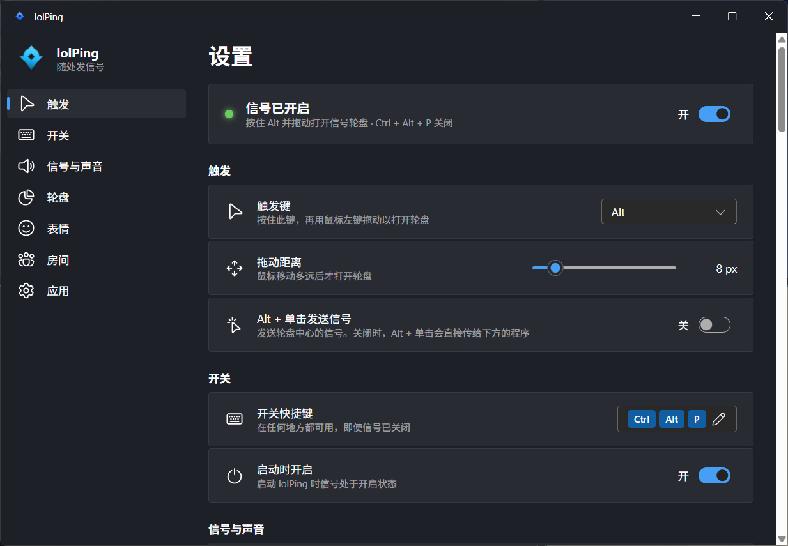

<h1 align="center"><br>lolPing</h1>

<p align="center">
  <a href="README.md">English</a> | 简体中文
</p>

<p align="center">
  把英雄联盟的信号轮盘搬到整个桌面，支持 Windows 和 macOS。<br>
  按住 <b>Alt</b>（Mac 上是 <b>⌥ Option</b>）拖动，在想要的信号上松开：动画弹出、音效响起，任何程序之上、任何显示器上都可以。
</p>

<p align="center">
  <a href="https://github.com/darrenprx/lolPing/releases/latest"><b>下载 Windows 版</b></a> ·
  <a href="https://github.com/darrenprx/lolPing/releases/latest"><b>下载 Mac 版</b></a>（Apple 芯片，实验性）
</p>

<p align="center">
  <a href="https://github.com/darrenprx/lolPing/actions/workflows/ci.yml"></a>
  <a href="https://github.com/darrenprx/lolPing/releases/latest"></a>
  <a href="LICENSE"></a>
</p>

<p align="center"></p>

信号会出现在全屏录制/共享画面里，所以在 Discord 或 OBS 上看你直播的朋友也能看到。lolPing 只是一个桌面小玩具：它不会读取、修改或注入英雄联盟本身。

## 安装

### Windows

1. 从[最新版本](https://github.com/darrenprx/lolPing/releases/latest)下载 `lolPing-Setup-<版本号>.exe`。
2. 运行安装程序。安装程序没有代码签名，Windows SmartScreen 可能会提示“Windows 已保护你的电脑”：点击**更多信息**，再点**仍要运行**。
3. lolPing 会打开设置窗口并常驻系统托盘。按住 Alt 在任意位置拖动即可发信号。

lolPing 面向 64 位 Windows 11。Windows 10 也许可以用，但没有测试过。

### macOS（实验性）

Mac 版需要 Apple 芯片（M1 或更新）的 Mac 和 macOS 12 或更新版本。它会自动构建和测试，但还没在真实的 Mac 上用过多少。遇到问题请[反馈](https://github.com/darrenprx/lolPing/issues)。

1. 从[最新版本](https://github.com/darrenprx/lolPing/releases/latest)下载 `lolPing-<版本号>-arm64.dmg`，打开后把 lolPing 拖进“应用程序”。
2. 打开 lolPing。它没有经过注册 Apple 开发者的签名，macOS 会提示无法检查其是否包含恶意软件：点“完成”，打开**系统设置 → 隐私与安全性**，向下滚动，在 lolPing 的提示旁点**仍要打开**并确认。
   如果 macOS 提示 lolPing“已损坏”，请在“终端”中运行 `xattr -dr com.apple.quarantine /Applications/lolPing.app`，然后再次打开。
3. lolPing 会请求**辅助功能**权限，用来读取鼠标和键盘。点“打开系统设置”并打开 lolPing。授权后立即可以发信号。
4. lolPing 常驻菜单栏。按住 ⌥ Option 在任意位置拖动即可发信号。

**每次更新后**，macOS 都会忘记辅助功能权限，因为应用没有固定的开发者签名。在**隐私与安全性 → 辅助功能**中选中 lolPing，点 **–** 移除，再重新打开。设置窗口会一步步提示你。

## 使用

| 想要 | 操作 |
| --- | --- |
| 发信号 | 按住 **Alt** 拖动，在某个扇区上松开 |
| 取消 | 在中心松开、点右键，或按 **Esc** |
| 暂停 / 恢复 | **Ctrl + Alt + P** |
| 打开设置 | 单击托盘图标 |
| 退出，或重启输入助手 | 右键托盘图标 |

在 Mac 上：用 **⌥ Option** 代替 Alt，用 **⌃⌥P** 暂停，用菜单栏中的信号图标代替托盘图标。

轮盘从正上方开始顺时针依次是：危险（撤退）、推进、正在赶来、全力进攻（All In）、请求协助、需要视野、敌人消失、敌方视野。可以在设置中重新排列，或换上诱饵、视野已清除。

## 设置



- **触发键：** Alt、Ctrl、Shift、Win、Caps Lock、鼠标侧键 4/5，或任意其他按键（Mac 上：Option、Control、Shift、Command、鼠标侧键 4/5，或任意其他按键）。开启信号时，自定义按键在其他程序里不会再输入字符。
- **Alt + 单击发送信号：** 默认关闭，这样平时的 Alt + 单击快捷操作不受影响。发送的是轮盘编辑器中心的信号（默认是普通信号）。
- **开关快捷键：** 必须包含 Ctrl、Alt 或 Win（Mac 上为 ⌃、⌥ 或 ⌘）。
- **信号与声音：** 大小、持续时间、音量、静音、轮盘提示音。
- **轮盘：** 把任意信号（包括诱饵和视野已清除）拖到任意扇区，或拖到中心设为 Alt + 单击发送的信号。单击信号可预览。**恢复默认**会还原英雄联盟的布局。
- **开机启动**（Mac 上为**登录时打开**）：启动后隐藏在托盘或菜单栏中。
- **语言：** 默认跟随系统显示语言，也可以手动选择 English 或简体中文。

设置在 Windows 上保存在 `%APPDATA%\lolPing\settings.json`，在 Mac 上保存在 `~/Library/Application Support/lolPing/settings.json`。

## 和朋友一起发信号（房间）

加入房间后，房间里的每个人都会在自己的屏幕上看到你的信号：位置相同（按各自的分辨率换算），下面带着你的名字。他们的信号也会出现在你的屏幕上。Windows 和 Mac 之间可以互通。

1. 一个人打开**设置 → 房间**（或托盘菜单 → **房间**），点击**创建房间**。
2. 复制房间码（例如 `PING-7KQ4M-2HXTR`）发给朋友。
3. 朋友复制房间码后，在托盘菜单中点击**从剪贴板加入**，或粘贴到房间页面后点击**加入**。

- 房间在同一个局域网中使用。第一次使用时，Windows 会询问是否允许 lolPing 使用网络：请允许，并把 Wi‑Fi 设置为**专用网络**（公用网络会被 Windows 阻止）。Mac 会询问是否允许查找本地网络中的设备。
- 不在同一个地方的朋友可以通过支持广播的虚拟局域网加入，例如 [ZeroTier](https://www.zerotier.com)、Radmin VPN。Tailscale 不转发广播，因此无法通过它找到房间成员。不借助虚拟局域网、直接通过互联网加入的功能正在计划中。
- 信号会显示在编号相同的显示器上（1 号是主显示器），没有则显示在 1 号上。
- **房间静音**、单独静音某个人，以及**接收信号上限**（可选不限）可以控制刷屏。用快捷键暂停 lolPing 时，房间信号也会一起暂停。
- 一个房间最多 8 人。想踢掉某人，就离开并创建一个新房间。
- **隐私：** 信号使用由房间码生成的密钥进行端到端加密，直接在设备之间传输，不经过任何服务器。房间里的人可以看到你的 IP 地址。

## 已知限制

- 在以管理员身份运行的窗口（例如任务管理器）上无法打开轮盘，因为 Windows 不会把这些窗口的输入交给普通程序。
- 独占全屏的游戏会盖住信号层。
- 只共享单个窗口时看不到信号，请改为共享整个屏幕。
- 在 Mac 上，登录窗口或密码提示等安全界面出现时无法打开轮盘；每次更新后需要重新允许辅助功能权限。

## 从源码构建

需要 Node 22.12 或更新版本，以及：

- **Windows：** Windows 11，以及安装了“使用 C++ 的桌面开发”工作负载的 Visual Studio 2022 或更新版本。
- **macOS：** 装有 Xcode 命令行工具（`xcode-select --install`）的 Apple 芯片 Mac。请为运行 `npm run dev` 的程序（例如“终端”）开启辅助功能权限，输入助手才能读取输入。

```bash
npm install
npx install-electron
npm run build:helper
npm run dev
```

`npx install-electron` 会下载 `npm run dev` 所需的 Electron 程序。

| 命令 | 作用 |
| --- | --- |
| `npm test` | TypeScript 测试，包括以 `--simulate` 模式运行真实输入助手的协议测试 |
| `npm run test:helper` | 构建输入助手并运行 C++ 测试 |
| `npm run typecheck` | 全量类型检查 |
| `npm run dist` | 在 `release/` 中生成 Windows 安装程序 |
| `npm run dist:mac` | 在 `release/` 中生成 Mac 磁盘映像（需在 Mac 上运行） |
| `npm run dev:site` | 启动轮盘的浏览器演示页（`site/`） |
| `npm run media` | 用演示页重新录制 `docs/media/demo.gif` 和 `docs/media/og.png`（需要 ffmpeg） |
| `node tools/room-peer/run.mjs <房间码>` | 以假成员身份加入房间并随机发信号，一台电脑也能试用房间功能（见 [`tools/room-peer`](tools/room-peer)） |

### 发布新版本

修改 `package.json` 中的 `version` 并提交，然后推送对应的标签，例如 `v0.2.0`。Release 工作流会自动构建 Windows 安装程序和 Mac 磁盘映像，并一起附加到 GitHub Release。

## 工作原理

- **输入：** [`native/hook-helper`](native/hook-helper) 是一个小型 C++ 进程，在 Windows 上负责底层鼠标和键盘钩子，在 macOS 上使用事件监听（event tap）。它会吞掉 Alt + 拖动，使下面的程序完全收不到，并通过 stdin/stdout 以 JSON 行与 Electron 通信。
- **显示：** Electron 在每个显示器上用一个透明、可点击穿透、始终置顶的窗口绘制轮盘和信号（[`src/renderer/overlay`](src/renderer/overlay)），并用 Web Audio 播放音效。
- **房间：** [`src/main/roomManager.ts`](src/main/roomManager.ts) 管理房间成员，并加密每条消息（AES-256-GCM，密钥由房间码经 scrypt 生成）。[`src/main/lanTransport.ts`](src/main/lanTransport.ts) 通过局域网 UDP 传输加密后的数据包。
- **设置：** Fluent UI 窗口（[`src/renderer/settings`](src/renderer/settings)），在 Windows 上使用 Mica 材质，在 macOS 上采用“系统设置”风格。
- **演示页：** [`site`](site) 在浏览器中运行同一套信号层代码，用一个小的输入适配层代替输入助手。README 里的 GIF 就是用它录制的。
- **设计文档：** [docs/design.md](docs/design.md)（英文）介绍了通信协议、输入状态机和多显示器坐标换算；[docs/design-macos.md](docs/design-macos.md)（英文）介绍了 Mac 版的移植。

## 信号素材

`assets/textures` 中的图标和 `assets/sounds` 中的音效提取自本地安装的英雄联盟。游戏更新后如何重新提取，请见 [`tools/extract-assets`](tools/extract-assets)。

## 许可证

代码采用 [MIT 许可证](LICENSE)。信号图标和音效版权归 Riot Games 所有，不在该许可证范围内。如果你代表 Riot Games 并希望移除相关内容，请提交 issue。

lolPing isn't endorsed by Riot Games and doesn't reflect the views or opinions of Riot Games or anyone officially involved in producing or managing Riot Games properties. Riot Games, and all associated properties are trademarks or registered trademarks of Riot Games, Inc.
